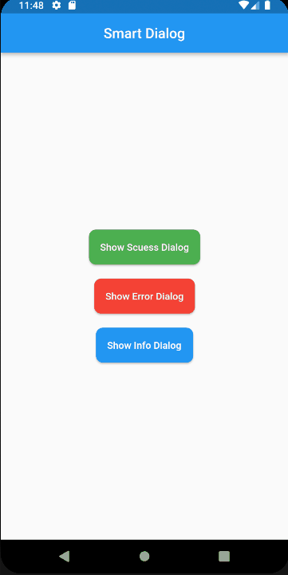

# Simple Dialogs Flutter (Liquid Glass Edition)

[](https://pub.dev/packages/simple_dialogs_flutter)
[](https://opensource.org/licenses/MIT)

**Simple Dialogs Flutter** is a premium, context-less overlay system for Flutter. It provides a stunning **Liquid Glass** aesthetic (glassmorphism) with fluid, physics-based animations that make your app feel like iOS 18+.



## 🚀 Key Features

- **Context-less API**: Trigger dialogs, toasts, and loaders from anywhere (even from business logic or services) without passing `BuildContext`.
- **Liquid Glass UI**: Beautiful backdrop blur, vibrant tints, and procedural glass effects.
- **Physics-Based Animations**: Fluid elastic motions and spring-driven transitions.
- **Positional Toasts**: Align toasts to the **Top** or **Bottom** of the screen.
- **Animated Progress Bars**: Visual countdown timers for toasts.
- **Dual-Action Dialogs**: Support for Primary and Secondary actions with custom callbacks.
- **Granular Customization**: Control blur intensity, opacity, and border radius via `GlassStyle`.

---

## 📦 Getting Started

### 1. Installation

Add the dependency to your `pubspec.yaml`:

```yaml
dependencies:
  simple_dialogs_flutter: ^2.2.0
```

### 2. Initialization

Set the `navigatorKey` in your `MaterialApp` to enable context-less overlays:

```dart
import 'package:simple_dialogs_flutter/simple_dialogs_flutter.dart';

void main() {
  runApp(MaterialApp(
    navigatorKey: SimpleDialogs.navigatorKey,
    // ...
  ));
}
```

---

## 🛠 Usage

### 💬 Premium Dialog

Show a professional glassmorphism dialog with dual actions:

```dart
SimpleDialogs.show(
  title: 'Delete Item?',
  description: 'Are you sure you want to permanently delete this file?',
  primaryActionLabel: 'Delete',
  secondaryActionLabel: 'Cancel',
  onPrimaryAction: () => print('Deleted'),
  onSecondaryAction: () => print('Cancelled'),
);
```

### 🍞 Smart Toast

Display a sleek pill-shaped toast at the top or bottom:

```dart
SimpleDialogs.toast(
  message: 'Settings updated successfully!',
  type: ToastType.success,
  position: OverlayPosition.top, // Optional: top or bottom
  showProgressBar: true,         // Optional: visual timer
);
```

### ⏳ Loader

Trigger a non-dismissible glass loader:

```dart
SimpleDialogs.loading(message: 'Syncing data...');

// Close it when done
SimpleDialogs.dismiss();
```

---

## 🎨 Advanced Customization

### The `GlassStyle` Object

Tweak the glass properties to match your brand:

```dart
SimpleDialogs.toast(
  message: 'Custom Style',
  style: GlassStyle(
    blur: 25.0,
    backgroundOpacity: 0.2,
    borderOpacity: 0.3,
    borderRadius: 12.0,
  ),
);
```

---

## 🌟 What Makes It Different?

Unlike most dialog packages, **Simple Dialogs Flutter** focuses on **High-End Aesthetics** and **Ease of Maintenance**. It hides the complexity of `OverlayEntry` management and `BackdropFilter` implementation behind a clean, readable API. It’s built for "Senior Developer" quality code with a clear separation between UI widgets and configuration models.

## 📄 License
This project is licensed under the MIT License - see the [LICENSE](LICENSE) file for details.
